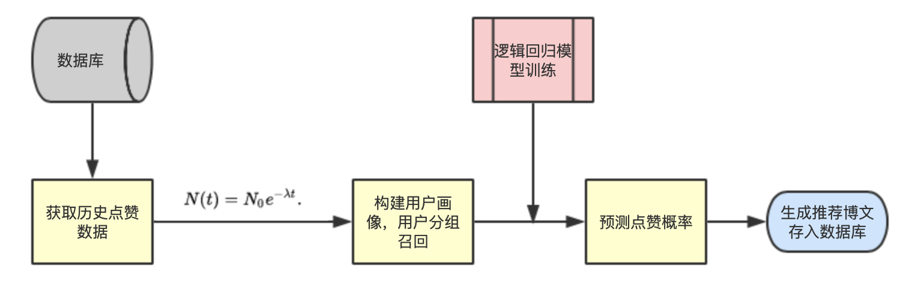
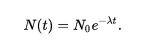
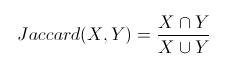

## 推荐系统

总体框架图：

- 基于标签的博文离线推荐

  - 召回

    - 获取用户最近七天的点赞数据

    - 计算用户对每个博文标签的喜好权重，构建用户画像

      

      N0为 1，λ(衰减常数)为0.012

      七天前点赞行为对标签的贡献约为0.1

    - 获取用户喜好度最高的两个大类

      将用户归于这两个组。

      从每个组中用户最近的点赞数据中随机取500个作为召回数据

      即每个用户召回1000条博文

  - 排序

    - 模型训练

      - 训练样本

        同组用户最近点赞博文，同组用户最近被推荐的但是没点赞的博文。

      - 训练：逻辑回归 （使用sklearn库）

    - 预测点赞概率

      - 使用训练模型对博文召回的1000条博文进行预测
      - 取前200条作为推荐博文（用户可能感兴趣的博文）

- 个人资料页推荐用户可能感兴趣的用户

  计算用户相似度

  

  X为第一个用户的粉丝群体， Y为第二个用户的粉丝群体

- 博文详情页推荐用户可能感兴趣的博文

  计算博文相似度

  

  X为第一个博文的点赞群体，Y为第二个博文的点赞群体

- 运行

  每日三点运行产生离线数据

  