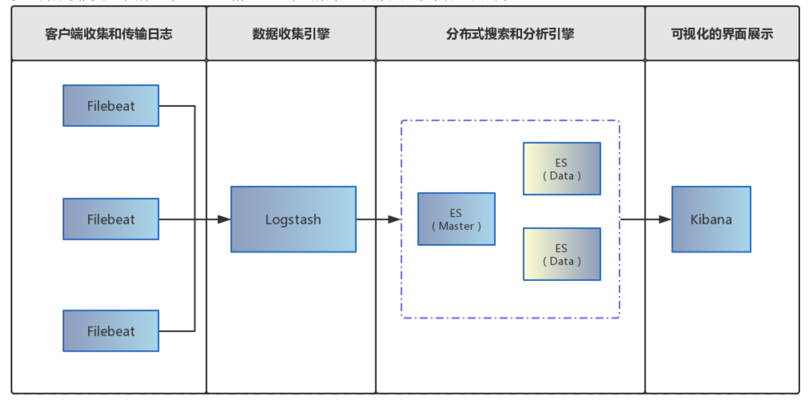
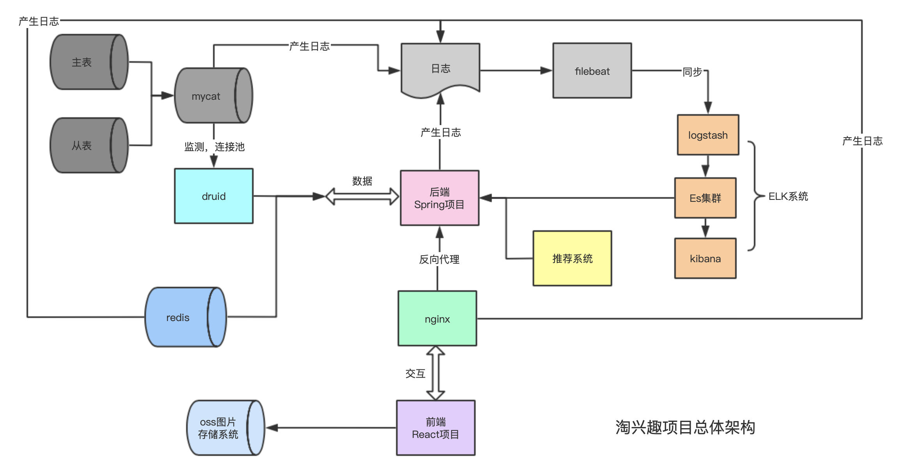
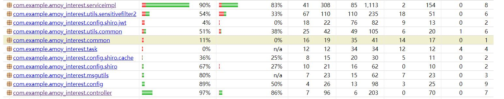
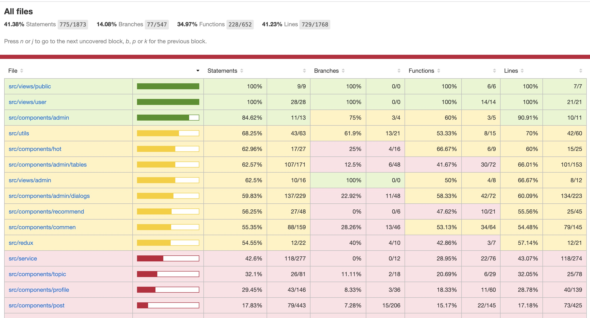

# 淘兴趣第十组汇总文档

### 小组信息

| 姓名   | 学号         | GitHub账号                                                   |
| ------ | ------------ | ------------------------------------------------------------ |
| 张懿雯 | 518021911211 | [Bessss-zyw](https://github.com/orgs/Amoy-interest/people/Bessss-zyw) |
| 姚镔炜 | 518021911182 | [BigBinnie](https://github.com/orgs/Amoy-interest/people/BigBinnie) |
| 吴泽川 | 518021910168 | [bigOnion](https://github.com/orgs/Amoy-interest/people/explodingnerk) |
| 莫戈泉 | 518021910917 | [mokkkkk](https://github.com/orgs/Amoy-interest/people/mokkkkk) |

### 功能需求

##### 普通用户部分

- 用户功能
  - 注册登陆功能：未注册账号的用户可以在register页面注册成为新用户，而游客（未登录状态）在访问网站时无法对网站内容进行操作（如搜索、点赞等）。
  - 修改个人信息功能：注册后生成新用户的默认个人信息，登陆后用户可以在个人资料页对自己的个人信息（如头像、地址、简介等）进行修改。
  - 关注功能：每个用户头像都是一个用户的个人主页入口，个人主页展示用户个人信息以及发布博文。用户之间可以互相关注，用户关注以及被关注的情况同样可以在个人住页看到。
- 博文功能
  - 发布博文：用户可以在个人的发现页进行发布博文操作。每一篇博文需要添加标签以作为推荐基础，标签由预搜索功能提供（用户无法自行创造新标签）；每一篇博文可以进行配图（图片上限9张）。
  - 博文展示功能：不同界面展示的博文不同。游客看到的登陆前页面展示的是随机博文；用户登陆后进入的主页根据用户的个人喜好画像对用户进行博文推送；搜索页面展示博文搜索结果；group页展示被点击侧边栏大类中的博文；发现页展示用户关注对象以及用户个人发布的博文；用户个人页展示该用户发布的所有博文。
  - 博文搜索功能：header的搜索框可以对博文进行搜索，点击搜索图标可以跳转至搜索界面对搜索结果（博文部分）进行展示。
  - 博文其他功能：用户登陆后可以修改或删除自己的博文，也可以对所有可见的博文进行点赞、转发、评论（评论还分为一级和二级评论）等操作。
- 话题功能
  - 博文和话题的关系：话题即标签，每个博文包含1-5个标签（从属于1-5个话题）。
  - 热榜功能：网站定时根据各话题浏览量对各话题热度进行计算，热度排名最高的若干话题在热榜展示。热榜的每个条目都是该条目话题的入口，点击即可进入话题页。
  - 话题展示：话题页展示带该话题标签的所有博文，按热度、时间等综合排序后进行展示；同时话题页下也可以发布博文（默认会带上该话题的标签）。

##### 管理员部分

- 用户管理
  - 用户管理列表：被举报次数过多的用户会反应到管理员的问题用户列表。
  - 用户封号功能：管理员可以直接对表中的用户进行封号操作（可以选择封号时间）。被封号的用户可以在管理员的被封号用户列表中找到，可以被重新解封。
  - 用户禁言功能：管理员可以直接对表中的用户进行封号操作（可以选择封号时间）。被封号的用户可以在管理员的被封号用户列表中找到，可以被重新解封。
- 博文管理
  - 博文管理列表：被举报次数过多的博文会反应到管理员的问题博文列表。
  - 博文管理功能：管理员可以直接对表中的博文进行通过或删除处理（被删除后的博文将对所有人不可见），也可以对博文相关用户进行封号、禁言管理。
- 话题管理
  - 话题管理列表：被举报次数过多的话题会反应到管理员的问题话题列表。
  - 话题管理功能：管理员可以直接对表中的话题进行通过或删除处理，被删除后的话题将无法在话题页展示相关博文，相关博文依然保留。
- 敏感词管理
  - 敏感词功能：当用户发博内容含有敏感词时，博文将无法发布，点击发布提示博文含有敏感词。
  - 敏感词管理功能：管理员可以直接对表中的敏感词进行编辑或删除处理，同时也可以新增敏感词。
- 其他说明
  - 多维度管理：管理员可以访问包括管理员页面在内的所有页面，每个页面中展示的博文或话题头都为管理员提供了管理接口，方便管理。

##### 热度部分（[具体方案](https://github.com/Amoy-interest/Doc/blob/master/final/热度算法.md)）

- 博文热度根据博文近段时间的点赞、评论、转发量计算，每隔1小时计算一次。
- 话题热度根据话题三天内的浏览量以及发博时间进行计算，每隔1小时计算一次。

##### 推荐部分（[具体方案](https://github.com/Amoy-interest/Doc/blob/master/final/推荐算法.md)）

- 每隔一段时间做推荐计算
- 对用户、话题进行分组
- 从数据库获取用户数据，并构建个人画像，最后生成推荐博文

### 非功能需求

##### 性能优化

* 计数器优化

  * 点赞，评论数，转发数等计数信息利用 *mysql + redis* 的形式存储。

  * 例子：用户对博文点赞时，先查看redis中是否存储该博文的点赞数以及博文的点赞记录，如果没有，则从mysql中导出。在redis中进行计数。然后定期将 *redis* 中的数据存回 *mysql* 。

* *mycat* 设置读写分离
  * mysql建主从表，主表用于写，从表用于读，*mycat* 作为中间件与后端连接实现读写分离。
  * 未来还可以进行分表（将一张表分开存储）、分库（分散到多个数据库）等拓展操作
* 转发、写博文优化
  * 原方案：新建博文、转发博文都需要同时向 *Mysql* 和 *Es* 中插入数据
  * 改进：*logstash* 通过 *mysql* 日志去监控 *blog* 表，并增量同步到 *Es*，从而提升写博文性能

##### 安全问题

- 授权与认证
  - 框架： *Apache Shiro + jwt*
  - 登录认证：利用jwt生成token作为用户登录凭证，shiro自带一级缓存存储用户登录信息，对用户token进行刷新延时。
  - 权限认证：
    - 粗粒度：数据库中存用户-角色-权限表，shiro从数据库中获取用户资源权限，对用户进行权限认证。
    - 细粒度：token中存储用户id，用户名信息，根据用户id在业务层进行更细粒度的权限管理（如：只能修改自己的用户信息等）
- 用户密码加密存储：使用 *AES算法* 加密后再将用户密码存入数据库

##### CI/CD

- 前端自动化测试及部署
  - 主要工具： *Jenkins + docker-compose + git + nginx* 
  - 主要过程：
    - 利用 *git* 持续化集成代码
    - *Jenkins* 拉取、发送最新代码到指定前端服务器
    - *Jenkins* 在目标服务器对项目进行构建和测试
    - 将 *nginx* 作为反向代理，用 *docker-compose* 运行前端
- 后端自动化部署
  - 主要工具： *git + Jenkins + docker-compose + maven + nginx* 
  - 主要过程：
    - 利用 *git* 持续化集成代码
    - *Jenkins* 拉取并构建代码，生成jar包发送到指定的远程服务器的指定目录下
    - 将 *nginx* 作为反向代理，执行 *docker-compose* 指令，删除旧容器，运行新的容器。

##### OSS

- OSS是阿里云对象存储服务，我们的系统使用OSS来为用户存储头像、博文等图片文件
- 使用OSS的STS临时授权的方式：由后端发送临时访问令牌给前端，前端再利用令牌直接访问OSS上传文件

##### 爬虫 （见[文档记录](https://github.com/Amoy-interest/Doc/blob/master/record/爬虫.md)）

##### 运维（ELK日志监控系统）

- Filebeat收集nginx、后端、数据库的日志进行初步的处理和分类，传输给Logstash
- Logstash根据不同的日志类型进行整理，对nginx的日志进行解析，获得用户访问记录的API和query中传递的变量值以服务于热度计算；Logstash将数据传送Elastic Search中建立索引，同时将日志按天进行分片
- ES收集来自Logstash的日志记录，供后端和Kibana进行查询
- Kibana对ES中的数据进行可视化处理，可以实时观测到当前服务器中后端和数据库运行的情况

###项目架构及设计

- 前端使用React框架，后端使用Spring框架
- nginx作为后端反向代理与前端交互
- 左边是数据库部分：Mycat主表从表用作读写分离，druid作为和后端之间的连接池兼监测；redis作为mysql的缓存，主要存储计数器信息
- 右边是ELK日志系统，由filebeat收集、同步日志，logstash整理，ES计算，Kibana展示（在我们的系统中，ELK不仅作为日志监测系统，也为后端提供日志统计计算、博文搜索等功能）
- 图片存储使用OSS，减轻数据库压力

###测试

##### 后端单元测试

- 最后总体覆盖率接近100%
- 没有到达100%主要有2个原因
  - service层的覆盖率没到100%是因为涉及到远程访问ES，没办法mock
  - controller层的覆盖率没到100%是因为oss那边，出异常的情况太少见

##### 前端单元测试

- 前端测试覆盖率不高，但能够通过 *Jenkins* 实现部署前的自动化测试

##### 性能测试（见[文档](https://github.com/Amoy-interest/Doc/blob/master/final/性能测试.md)）

##### 端到端测试（见[文档](https://github.com/Amoy-interest/Doc/blob/master/final/端到端测试.md)）

