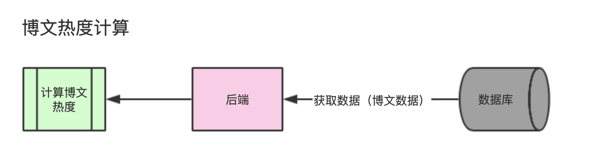
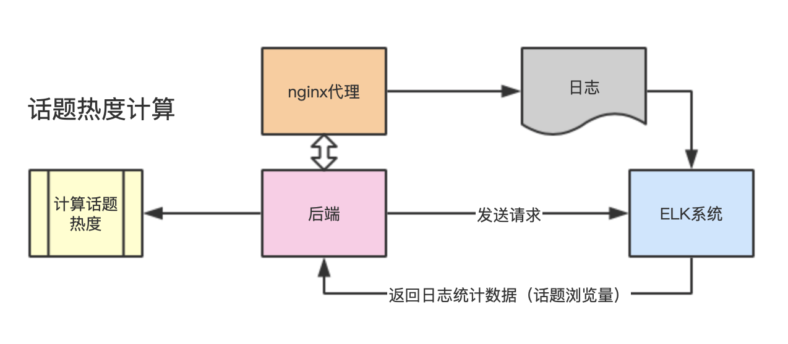

## 热度计算

##### 对于博文

- 需要的数据
  - 博文发表时间（blog表中blog_time字段）
  - 博文被点赞、评论、转发的数据（blog_count表中forward_count、vote_count、comment_count字段）
- 计算
  - 采用Reddit算法（原公式：$SRRank = (log_{10}Z+ts/45000)$），并做一定的参数调整
  - 公式：$SRRank=100 *(log_{5}Z+ts/90000)，Z= Vote * 2 + Comment * 5 + Forward * 10$ 
  - 公式解说：相比较Reddit公式中的原本参数做了一些调整，因为Reddit用户较多可以将用户影响力参数调的比较低，而我们的网站用户相对较少，因而我们需要在原有公式的基础上增加用户的影响度，相对削弱时间影响度，最后乘上100是因为存在数据库中的是整数）
  - 方式：对三天内发布的博文每一小时计算一次，三天前到一个月前的博文每天计算一次，一个月前的博文每月计算一次
- 计算之后存入数据库
  - 数据库中建一张表专门用来记录计算好的博文热度
  - 表结构：blog_id，blog_heat
- 涉及博文热度的API
  - 推荐API
  - 获取话题最热博文API
    - join三张表（topic_blog，blog_heat，topic）获取该话题下所有博文以及对应热度
    - 按照热度排序拿到分页后的blog_id，再根据blog_id去blog表中获取blog内容
    - 注：这里的时间都指发布时间而非修改时间
  - 获取话题博文API不需要改动，继续按照时间排序
  - 获取个人博文也不需要改动，继续按照时间排序

##### 对于话题

- 需要的数据

  - 从esl处获取近2天话题点击量最高的100个话题
  - esl同时返回每个话题分段点击数
    - 近12h，$Pageviews_1$
    - 近12-24h，$Pageviews_2$
    - 近24-48h，$Pageviews_3$

- 计算

  - 公式：$Score = Pageviews_1 + Pageviews_2 * 0.4 + Pageviews_3 * 0.2$
  - 对象：近2天点击量前百的话题
  - 方式：每小时计算一次，可以和计算博文错开

- 计算之后存入数据库

  - 用redis来记录计算好的话题热度

